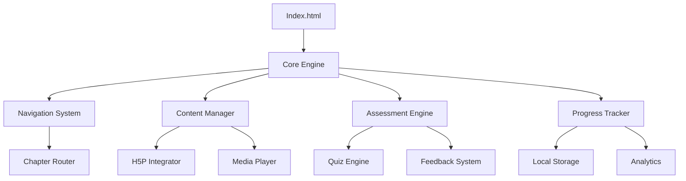

# Guia Técnico de Desenvolvimento e Hospedagem

## 📋 Índice

- [Guia de Desenvolvimento](#-guia-de-desenvolvimento)
- [Estrutura Técnica](#-estrutura-técnica)
- [Configuração do GitHub Pages](#-configuração-do-github-pages)
- [Deploy Automatizado](#-deploy-automatizado)
- [Monitoramento e Analytics](#-monitoramento-e-analytics)
- [Manutenção](#-manutenção)

---

## 🔧 Guia de Desenvolvimento

### Pré-requisitos

**Ferramentas Necessárias:**
```bash
# Node.js (versão 16+)
node --version

# Git
git --version

# Editor de código (VS Code recomendado)
code --version
```

**Extensões Recomendadas para VS Code:**
- HTML CSS Support
- JavaScript (ES6) Code Snippets  
- Live Server
- Prettier - Code Formatter
- GitLens
- Auto Rename Tag

### Configuração do Ambiente de Desenvolvimento

1. **Clone do Repositório:**
```bash
git clone https://github.com/pamellabiotec/produto-educacional-cnmc3.git
cd produto-educacional-cnmc3
```

2. **Configuração Inicial:**
```bash
# Instalar dependências de desenvolvimento
npm install

# Configurar hooks do Git
npm run setup

# Iniciar servidor de desenvolvimento
npm run dev
```

3. **Estrutura de Pastas:**
```
src/
├── assets/
│   ├── css/
│   │   ├── main.css          # Estilos principais
│   │   ├── components.css    # Estilos de componentes
│   │   ├── responsive.css    # Media queries
│   │   └── accessibility.css # Estilos de acessibilidade
│   ├── js/
│   │   ├── main.js          # Script principal
│   │   ├── components/      # Componentes JavaScript
│   │   ├── utils/           # Utilitários
│   │   └── config.js        # Configurações
│   ├── images/
│   │   ├── icons/           # Ícones SVG
│   │   ├── backgrounds/     # Imagens de fundo
│   │   └── characters/      # Avatares e personagens
│   └── data/
│       ├── questions.json   # Banco de questões
│       ├── scenarios.json   # Cenários do RPG
│       └── config.json      # Configurações gerais
├── components/
│   ├── Navigation.js        # Componente de navegação
│   ├── Player.js           # Player de mídia
│   ├── Quiz.js            # Sistema de quiz
│   └── Progress.js        # Barra de progresso
├── pages/
│   ├── intro.html          # Página de introdução
│   ├── chapter1.html       # Capítulo 1
│   └── ...                # Outros capítulos
└── docs/                  # Documentação
```

### Padrões de Código

**JavaScript (ES6+):**
```javascript
// Use const/let ao invés de var
const gameConfig = {
  difficulty: 'medium',
  language: 'pt-BR'
};

// Arrow functions para callbacks
const initGame = () => {
  console.log('Jogo iniciado');
};

// Async/await para operações assíncronas
const loadData = async () => {
  try {
    const response = await fetch('./data/questions.json');
    return await response.json();
  } catch (error) {
    console.error('Erro ao carregar dados:', error);
  }
};

// Classes para componentes complexos
class GameComponent {
  constructor(element) {
    this.element = element;
    this.init();
  }
  
  init() {
    this.bindEvents();
  }
  
  bindEvents() {
    // Eventos do componente
  }
}
```

**CSS (BEM Methodology):**
```css
/* Block */
.game-interface {
  display: flex;
  flex-direction: column;
}

/* Element */
.game-interface__header {
  background: var(--primary-color);
  padding: 1rem;
}

/* Modifier */
.game-interface--dark-mode {
  background: var(--dark-bg);
  color: var(--dark-text);
}

/* CSS Custom Properties */
:root {
  --primary-color: #007bff;
  --secondary-color: #6c757d;
  --success-color: #28a745;
  --danger-color: #dc3545;
  --warning-color: #ffc107;
}
```

**HTML Semântico:**
```html
<!DOCTYPE html>
<html lang="pt-BR">
<head>
  <meta charset="UTF-8">
  <meta name="viewport" content="width=device-width, initial-scale=1.0">
  <title>Reino dos Elementos</title>
  
  <!-- SEO Meta Tags -->
  <meta name="description" content="RPG educacional de Química">
  <meta name="keywords" content="química, educação, RPG, polímeros, radioatividade">
  
  <!-- Open Graph -->
  <meta property="og:title" content="Reino dos Elementos">
  <meta property="og:description" content="RPG educacional de Química">
  <meta property="og:type" content="website">
  
  <!-- Accessibility -->
  <link rel="preload" href="./assets/css/main.css" as="style">
  <link rel="stylesheet" href="./assets/css/main.css">
</head>
<body>
  <header role="banner">
    <nav role="navigation" aria-label="Menu principal">
      <!-- Navegação acessível -->
    </nav>
  </header>
  
  <main role="main">
    <!-- Conteúdo principal -->
  </main>
  
  <footer role="contentinfo">
    <!-- Rodapé -->
  </footer>
</body>
</html>
```

---

## 🏗️ Estrutura Técnica

### Arquitetura do Sistema



### Componentes Principais

**1. Game Engine (main.js)**
```javascript
class GameEngine {
  constructor() {
    this.currentChapter = 0;
    this.playerData = {};
    this.achievements = [];
    this.init();
  }
  
  init() {
    this.loadPlayerData();
    this.setupEventListeners();
    this.startChapter(this.currentChapter);
  }
  
  loadPlayerData() {
    const saved = localStorage.getItem('reino-elementos-save');
    this.playerData = saved ? JSON.parse(saved) : this.getDefaultData();
  }
  
  saveProgress() {
    localStorage.setItem('reino-elementos-save', JSON.stringify(this.playerData));
  }
}
```

**2. Navigation System (Navigation.js)**
```javascript
class Navigation {
  constructor() {
    this.currentPage = 'intro';
    this.history = [];
    this.init();
  }
  
  navigateTo(page, saveHistory = true) {
    if (saveHistory) {
      this.history.push(this.currentPage);
    }
    
    this.hidePage(this.currentPage);
    this.showPage(page);
    this.currentPage = page;
    this.updateURL(page);
  }
  
  goBack() {
    if (this.history.length > 0) {
      const previousPage = this.history.pop();
      this.navigateTo(previousPage, false);
    }
  }
}
```

**3. H5P Integration**
```javascript
class H5PManager {
  constructor() {
    this.activities = new Map();
    this.results = new Map();
  }
  
  async loadActivity(containerId, contentId) {
    try {
      const h5pInstance = await H5P.newRunnable({
        library: contentId.library,
        params: contentId.params
      }, H5P.jQuery(containerId));
      
      this.activities.set(containerId, h5pInstance);
      this.bindEvents(h5pInstance, containerId);
      
    } catch (error) {
      console.error('Erro ao carregar atividade H5P:', error);
      this.showFallbackContent(containerId);
    }
  }
  
  bindEvents(instance, containerId) {
    instance.on('xAPI', (event) => {
      this.handleXAPIEvent(event, containerId);
    });
  }
}
```

### Performance e Otimização

**Lazy Loading de Conteúdo:**
```javascript
class ContentLoader {
  static async loadChapter(chapterNumber) {
    const chapterPath = `./chapters/chapter${chapterNumber}.html`;
    
    try {
      const response = await fetch(chapterPath);
      if (!response.ok) throw new Error(`HTTP ${response.status}`);
      
      const content = await response.text();
      return this.processContent(content);
      
    } catch (error) {
      console.error(`Erro ao carregar capítulo ${chapterNumber}:`, error);
      return this.getFallbackContent(chapterNumber);
    }
  }
  
  static processContent(html) {
    // Processar conteúdo, injetar componentes dinâmicos
    const parser = new DOMParser();
    const doc = parser.parseFromString(html, 'text/html');
    
    // Processar elementos especiais
    this.processH5PElements(doc);
    this.processVideoElements(doc);
    
    return doc.body.innerHTML;
  }
}
```

**Service Worker para Cache:**
```javascript
// sw.js
const CACHE_NAME = 'reino-elementos-v1.0.0';
const urlsToCache = [
  '/',
  '/assets/css/main.css',
  '/assets/js/main.js',
  '/assets/images/logo.png',
  // Lista completa de recursos
];

self.addEventListener('install', (event) => {
  event.waitUntil(
    caches.open(CACHE_NAME)
      .then((cache) => cache.addAll(urlsToCache))
  );
});

self.addEventListener('fetch', (event) => {
  event.respondWith(
    caches.match(event.request)
      .then((response) => {
        return response || fetch(event.request);
      })
  );
});
```

---

## 🚀 Configuração do GitHub Pages

### Setup Inicial

**1. Configuração do Repositório:**
```bash
# Criar repositório no GitHub
gh repo create pamellabiotec/produto-educacional-cnmc3 --public

# Configurar branch principal
git checkout -b main
git push -u origin main

# Configurar GitHub Pages
gh api repos/pamellabiotec/produto-educacional-cnmc3/pages \
  --method POST \
  --field source='{"branch":"main","path":"/"}'
```

**2. Arquivo de Configuração (_config.yml):**
```yaml
# _config.yml para Jekyll (opcional)
title: Reino dos Elementos
description: RPG Educacional de Química
url: "https://pamellabiotec.github.io"
baseurl: "/produto-educacional-cnmc3"

# Configurações de build
markdown: kramdown
highlighter: rouge
theme: minima

# Plugins
plugins:
  - jekyll-sitemap
  - jekyll-seo-tag
  - jekyll-feed

# Exclusões
exclude:
  - node_modules
  - .gitignore
  - README.md
  - package.json
  - gulpfile.js
```

**3. Domínio Personalizado (CNAME):**
```
# CNAME file
reino-elementos.pamellabiotec.com.br
```

### Otimizações para Produção

**Build Script (package.json):**
```json
{
  "scripts": {
    "dev": "live-server --host=localhost --port=3000",
    "build": "npm run minify && npm run optimize",
    "minify": "npm run minify-css && npm run minify-js",
    "minify-css": "cleancss -o dist/assets/css/main.min.css src/assets/css/*.css",
    "minify-js": "uglifyjs src/assets/js/*.js -o dist/assets/js/main.min.js",
    "optimize": "npm run optimize-images && npm run generate-sitemap",
    "optimize-images": "imagemin src/assets/images/* --out-dir=dist/assets/images",
    "generate-sitemap": "node scripts/generate-sitemap.js",
    "deploy": "npm run build && gh-pages -d dist",
    "test": "jest",
    "lint": "eslint src/**/*.js"
  },
  "devDependencies": {
    "live-server": "^1.2.2",
    "clean-css-cli": "^5.6.2",
    "uglify-js": "^3.17.4",
    "imagemin-cli": "^7.0.0",
    "gh-pages": "^4.0.0",
    "eslint": "^8.57.0",
    "jest": "^29.7.0"
  }
}
```

**GitHub Actions Workflow (.github/workflows/deploy.yml):**
```yaml
name: Build and Deploy
on:
  push:
    branches: [ main ]
  pull_request:
    branches: [ main ]

jobs:
  build-and-deploy:
    runs-on: ubuntu-latest
    steps:
    - name: Checkout 🛎️
      uses: actions/checkout@v3

    - name: Setup Node.js 📦
      uses: actions/setup-node@v3
      with:
        node-version: '18'
        cache: 'npm'

    - name: Install Dependencies 🔧
      run: npm ci

    - name: Run Tests 🧪
      run: npm test

    - name: Build Project 🏗️
      run: npm run build

    - name: Deploy to GitHub Pages 🚀
      uses: peaceiris/actions-gh-pages@v3
      if: github.ref == 'refs/heads/main'
      with:
        github_token: ${{ secrets.GITHUB_TOKEN }}
        publish_dir: ./dist
```

---

## 📊 Deploy Automatizado

### Processo de Deploy

**1. Deploy Manual:**
```bash
# Build local
npm run build

# Deploy para GitHub Pages
npm run deploy

# Verificar deploy
curl -I https://pamellabiotec.github.io/produto-educacional-cnmc3/
```

**2. Deploy Automatizado (GitHub Actions):**

**Script de Deploy (scripts/deploy.js):**
```javascript
const ghpages = require('gh-pages');
const path = require('path');

console.log('🚀 Iniciando deploy...');

ghpages.publish(
  path.join(__dirname, '../dist'),
  {
    branch: 'gh-pages',
    message: `Deploy ${new Date().toISOString()}`,
    user: {
      name: 'GitHub Actions',
      email: 'actions@github.com'
    }
  },
  (err) => {
    if (err) {
      console.error('❌ Erro no deploy:', err);
      process.exit(1);
    } else {
      console.log('✅ Deploy concluído com sucesso!');
      console.log('🌐 Site disponível em: https://pamellabiotec.github.io/produto-educacional-cnmc3/');
    }
  }
);
```

**3. Rollback de Deploy:**
```bash
# Listar deploys anteriores
gh api repos/pamellabiotec/produto-educacional-cnmc3/deployments

# Fazer rollback para commit anterior
git log --oneline -10
git revert <commit-hash>
git push origin main
```

### Ambientes de Deploy

**Staging (Branch develop):**
```yaml
# .github/workflows/staging.yml
name: Deploy Staging
on:
  push:
    branches: [ develop ]

jobs:
  deploy-staging:
    runs-on: ubuntu-latest
    steps:
    - uses: actions/checkout@v3
    - name: Deploy to Staging
      run: |
        npm run build
        gh-pages -d dist -r https://github.com/pamellabiotec/produto-educacional-cnmc3-staging.git
```

**Production (Branch main):**
- Deploy automático via GitHub Actions
- Testes obrigatórios antes do deploy
- Notificações de sucesso/falha

---

## 📈 Monitoramento e Analytics

### Google Analytics 4

**Configuração (analytics.js):**
```javascript
// Google Analytics 4 Configuration
const GA_MEASUREMENT_ID = 'G-XXXXXXXXXX';

// Initialize GA4
gtag('config', GA_MEASUREMENT_ID, {
  page_title: document.title,
  page_location: window.location.href,
  content_group1: 'Educational Content',
  content_group2: 'Chemistry RPG'
});

// Custom Events
class AnalyticsTracker {
  static trackChapterStart(chapterNumber) {
    gtag('event', 'chapter_start', {
      chapter_number: chapterNumber,
      content_group: 'Chapter Navigation'
    });
  }
  
  static trackActivityComplete(activityType, score) {
    gtag('event', 'activity_complete', {
      activity_type: activityType,
      score: score,
      engagement_time_msec: Date.now() - this.startTime
    });
  }
  
  static trackVideoProgress(videoId, progress) {
    gtag('event', 'video_progress', {
      video_id: videoId,
      video_progress: progress,
      content_group: 'Educational Videos'
    });
  }
}
```

### Performance Monitoring

**Web Vitals:**
```javascript
import { getCLS, getFID, getFCP, getLCP, getTTFB } from 'web-vitals';

const sendToAnalytics = (metric) => {
  gtag('event', metric.name, {
    event_category: 'Web Vitals',
    value: Math.round(metric.name === 'CLS' ? metric.value * 1000 : metric.value),
    event_label: metric.id,
    non_interaction: true,
  });
};

// Measure all Web Vitals
getCLS(sendToAnalytics);
getFID(sendToAnalytics);
getFCP(sendToAnalytics);
getLCP(sendToAnalytics);
getTTFB(sendToAnalytics);
```

**Error Tracking:**
```javascript
class ErrorTracker {
  static init() {
    window.addEventListener('error', this.handleError);
    window.addEventListener('unhandledrejection', this.handlePromiseRejection);
  }
  
  static handleError(event) {
    gtag('event', 'exception', {
      description: `${event.error.name}: ${event.error.message}`,
      fatal: false,
      error_line: event.lineno,
      error_column: event.colno,
      error_file: event.filename
    });
  }
  
  static handlePromiseRejection(event) {
    gtag('event', 'exception', {
      description: `Promise rejection: ${event.reason}`,
      fatal: false
    });
  }
}
```

---

## 🔧 Manutenção

### Atualizações de Segurança

**Dependências:**
```bash
# Verificar vulnerabilidades
npm audit

# Corrigir automaticamente
npm audit fix

# Atualizar dependências
npm update

# Verificar outdated packages
npm outdated
```

**Headers de Segurança (.htaccess ou configuração do servidor):**
```apache
# .htaccess (para Apache)
<IfModule mod_headers.c>
    Header set X-Content-Type-Options "nosniff"
    Header set X-Frame-Options "SAMEORIGIN"
    Header set X-XSS-Protection "1; mode=block"
    Header set Strict-Transport-Security "max-age=31536000; includeSubDomains"
    Header set Content-Security-Policy "default-src 'self'; script-src 'self' 'unsafe-inline' https://www.googletagmanager.com; style-src 'self' 'unsafe-inline'"
</IfModule>
```

### Backup e Restore

**Script de Backup:**
```bash
#!/bin/bash
# backup.sh
DATE=$(date +%Y%m%d_%H%M%S)
BACKUP_DIR="backups"
PROJECT_NAME="produto-educacional-cnmc3"

# Criar diretório de backup
mkdir -p $BACKUP_DIR

# Backup do código
git bundle create $BACKUP_DIR/${PROJECT_NAME}_${DATE}.bundle --all

# Backup de dados de analytics (se aplicável)
curl -H "Authorization: Bearer $ANALYTICS_TOKEN" \
     "https://analyticsreporting.googleapis.com/v4/reports:batchGet" \
     > $BACKUP_DIR/analytics_${DATE}.json

echo "Backup concluído: $BACKUP_DIR/${PROJECT_NAME}_${DATE}.bundle"
```

### Logs e Debug

**Sistema de Logs:**
```javascript
class Logger {
  static levels = {
    ERROR: 0,
    WARN: 1,
    INFO: 2,
    DEBUG: 3
  };
  
  static currentLevel = this.levels.INFO;
  
  static error(message, ...args) {
    if (this.currentLevel >= this.levels.ERROR) {
      console.error(`[ERROR] ${new Date().toISOString()}: ${message}`, ...args);
      this.sendToServer('error', message, args);
    }
  }
  
  static warn(message, ...args) {
    if (this.currentLevel >= this.levels.WARN) {
      console.warn(`[WARN] ${new Date().toISOString()}: ${message}`, ...args);
    }
  }
  
  static info(message, ...args) {
    if (this.currentLevel >= this.levels.INFO) {
      console.log(`[INFO] ${new Date().toISOString()}: ${message}`, ...args);
    }
  }
  
  static debug(message, ...args) {
    if (this.currentLevel >= this.levels.DEBUG) {
      console.log(`[DEBUG] ${new Date().toISOString()}: ${message}`, ...args);
    }
  }
  
  static sendToServer(level, message, args) {
    // Enviar logs críticos para servidor
    fetch('/api/logs', {
      method: 'POST',
      headers: { 'Content-Type': 'application/json' },
      body: JSON.stringify({
        level,
        message,
        args,
        timestamp: new Date().toISOString(),
        userAgent: navigator.userAgent,
        url: window.location.href
      })
    }).catch(() => {
      // Silently fail - não queremos quebrar a aplicação
    });
  }
}
```

### Checklist de Manutenção

**Semanal:**
- [ ] Verificar logs de erro
- [ ] Monitorar performance via Analytics
- [ ] Testar funcionalidades críticas
- [ ] Verificar status dos vídeos embarcados

**Mensal:**
- [ ] Atualizar dependências
- [ ] Revisar relatórios de uso
- [ ] Backup completo do projeto
- [ ] Teste de carga na aplicação

**Trimestral:**
- [ ] Auditoria de segurança
- [ ] Review do código
- [ ] Atualização da documentação
- [ ] Pesquisa de satisfação com usuários

**Anual:**
- [ ] Renovação de domínio (se aplicável)
- [ ] Revisão completa do conteúdo
- [ ] Planejamento de novas funcionalidades
- [ ] Análise de ROI educacional

---

## 🆘 Troubleshooting

### Problemas Comuns

**1. GitHub Pages não atualiza:**
```bash
# Forçar rebuild do GitHub Pages
git commit --allow-empty -m "Force GitHub Pages rebuild"
git push origin main
```

**2. H5P não carrega:**
```javascript
// Fallback para atividades H5P
const h5pFallback = {
  'interactive-video': '<iframe src="youtube-embed-url"></iframe>',
  'question-set': '<div class="fallback-quiz">Quiz não disponível</div>',
  // Outros tipos...
};
```

**3. Performance lenta:**
```bash
# Otimizar imagens
npm install -g imagemin-cli
imagemin assets/images/* --out-dir=dist/images --plugin=imagemin-mozjpeg --plugin=imagemin-pngquant

# Minificar recursos
npm run build:prod
```

---

**© 2024 Prof.ª Pâmella A. Balcaçar - Guia Técnico do Reino dos Elementos**